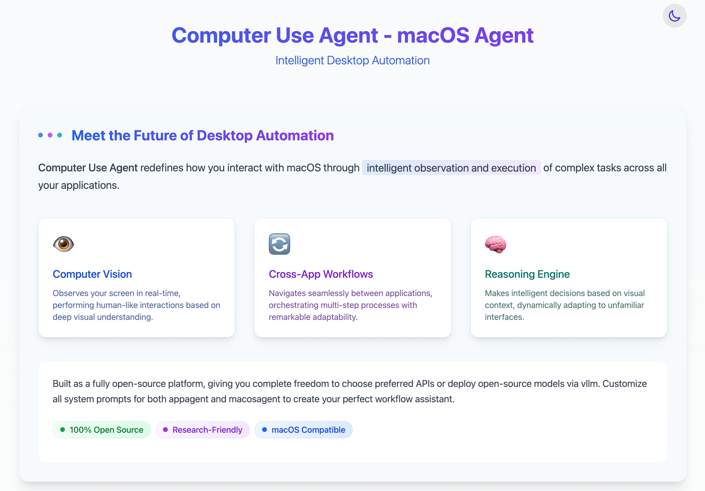

# Computer Use Agent Trace Viewer

A web-based visualization tool for Computer Use Agent traces, displaying the agent's thought process, actions, screenshots, and corresponding videos.



## 📋 Features

- Interactive timeline of agent activities with screenshots, thoughts, and actions
- Synchronized video playback
- Adjustable split view (drag to resize)
- Time-synchronized scrolling
- Multiple trace instances on a single page
- External JSON data support

## 🛠️ Prerequisites

- [Node.js](https://nodejs.org/) (v16.x or newer)
- npm (comes with Node.js) or [Yarn](https://yarnpkg.com/)
- Basic knowledge of React and Next.js

## 🚀 Getting Started

Follow these steps to set up and run the Computer Use Agent Trace Viewer from scratch:

### 1. Clone the Repository

```bash
git clone https://github.com/Computer-use-agents/CUA-Trace-Viewer.git
cd CUA-Trace-Viewer
```

Alternatively, create a new project directory and initialize from scratch:

```bash
mkdir cua-trace-viewer
cd cua-trace-viewer
```

### 2. Initialize a New Next.js Project (if starting from scratch)

```bash
npx create-next-app@latest . --typescript --tailwind --eslint
```

When prompted, select Yes for all options.

### 3. Install Dependencies

```bash
npm install
```

### 4. Create Project Structure

Create the required directories:

```bash
mkdir -p public/screenshots public/videos src/types src/components src/data
```

### 5. Place Your Media Files

Add your screenshot images and videos to the public directories:

```bash
# Example: Copy your files to the appropriate directories
cp path/to/your/screenshots/* public/screenshots/
cp path/to/your/videos/* public/videos/
```

### 6. Create Core Files

Create the following files with the content provided in our project:

#### src/types/trace.ts

```typescript
export interface TraceItem {
  timestamp: string;
  screenshot: string;
  thought: string;
  action: string;  // What action the agent is performing
  video: string;
  timeRange: {
    start: number; // Video start time (seconds)
    end: number;   // Video end time (seconds)
  };
}

export interface TraceData {
  items: TraceItem[];
}
```

#### src/data/trace1.json and src/data/trace2.json

Create JSON files to store your trace data:

```json
{
  "items": [
    {
      "timestamp": "2024-03-20T10:00:00Z",
      "screenshot": "/screenshots/image.png",
      "thought": "Agent is analyzing the current screen content...",
      "action": "click the button",
      "video": "/videos/test.mp4",
      "timeRange": {
        "start": 0,
        "end": 5
      }
    },
    // Add more items as needed
  ]
}
```

#### src/components/Timeline.tsx, VideoPlayer.tsx, and TraceViewer.tsx

Create these component files as provided in our project.

#### app/page.tsx and app/layout.tsx

Create these files to set up the main page and layout. Import JSON data in page.tsx:

```typescript
'use client';

import React, { useState } from 'react';
import TraceViewer from '../src/components/TraceViewer';
import trace1Data from '../src/data/trace1.json';
import trace2Data from '../src/data/trace2.json';

export default function Home() {
  // Component implementation
  return (
    <main>
      {/* TraceViewer components using imported data */}
      <TraceViewer data={trace1Data} id="viewer1" />
      <TraceViewer data={trace2Data} id="viewer2" />
    </main>
  );
}
```

### 7. Configure Next.js and Tailwind

Ensure you have the correct configurations in:
- next.config.js
- tailwind.config.js
- postcss.config.js

### 8. Start the Development Server

```bash
npm run dev
```

Visit [http://localhost:3000](http://localhost:3000) to see your trace viewer in action!

## ✨ Customization

### Modifying the Layout

- Adjust the default split ratio (currently 3:7) in the `TraceViewer` component by changing the `splitPosition` initial state
- Customize the styling using Tailwind classes in the component files

### Adding More Trace Viewers

To add more trace viewers, duplicate the viewer section in `app/page.tsx` and provide different data:

```tsx
{/* Additional Trace Viewer */}
<section>
  <div className="rounded-t-2xl p-4 flex justify-between items-center">
    <div>
      <h2 className="text-xl font-medium">Agent Activity Trace</h2>
      <p className="text-sm">Session 3: Another Example</p>
    </div>
  </div>
  <div className="h-[75vh] overflow-hidden rounded-b-2xl">
    <TraceViewer data={trace3Data} id="viewer3" />
  </div>
</section>
```

### Creating Additional JSON Data Files

To add more trace data files:

1. Create a new JSON file in `src/data/` directory:

```bash
touch src/data/trace3.json
```

2. Add your trace data to the file following the `TraceItem` interface format
3. Import and use the new data in your page:

```typescript
import trace3Data from '../src/data/trace3.json';

// Then use it in a TraceViewer component
<TraceViewer data={trace3Data} id="viewer3" />
```

### Loading Data from API

To load data from an API instead of importing JSON files:

```tsx
'use client';

import { useState, useEffect } from 'react';
import TraceViewer from '../src/components/TraceViewer';
import { TraceData } from '../src/types/trace';

export default function Home() {
  const [data1, setData1] = useState<TraceData | null>(null);
  const [loading, setLoading] = useState(true);
  
  useEffect(() => {
    async function fetchData() {
      try {
        const response = await fetch('/api/traces/1');
        const data = await response.json();
        setData1(data);
      } catch (error) {
        console.error('Error fetching trace data:', error);
      } finally {
        setLoading(false);
      }
    }
    
    fetchData();
  }, []);
  
  if (loading) return <div>Loading traces...</div>;
  
  return (
    <main>
      {data1 && <TraceViewer data={data1} id="viewer1" />}
    </main>
  );
}
```

## 📝 Configuration Options

### Environment Variables

Create a `.env.local` file in the root directory for environment-specific configuration:

```
NEXT_PUBLIC_API_URL=https://your-api-url.com
```

## 🔧 Troubleshooting

### Images or Videos Not Loading

- Ensure the paths in your data match the actual file paths in the `public` directory
- Paths should be relative to the `public` directory (e.g., `/screenshots/image.png`, not `public/screenshots/image.png`)
- Check browser console for any 404 errors

### JSON Data Issues

- Verify your JSON files are properly formatted with valid JSON
- Make sure all required fields are present (timestamp, screenshot, thought, action, video, timeRange)
- Check that timeRange contains valid start and end values

### Build Errors

If you encounter build errors, make sure all dependencies are properly installed:

```bash
npm install
```

## 🤝 Contributing

Contributions are welcome! Please feel free to submit a Pull Request.

## 📄 License

This project is open source and available under the [MIT License](LICENSE). 